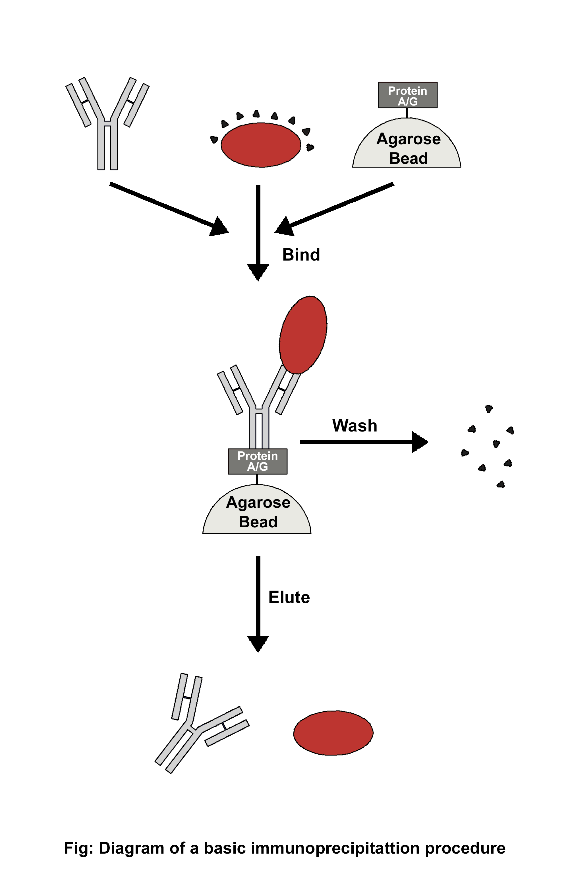
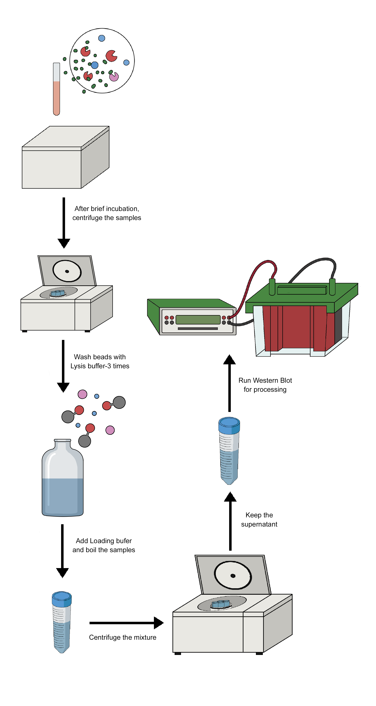
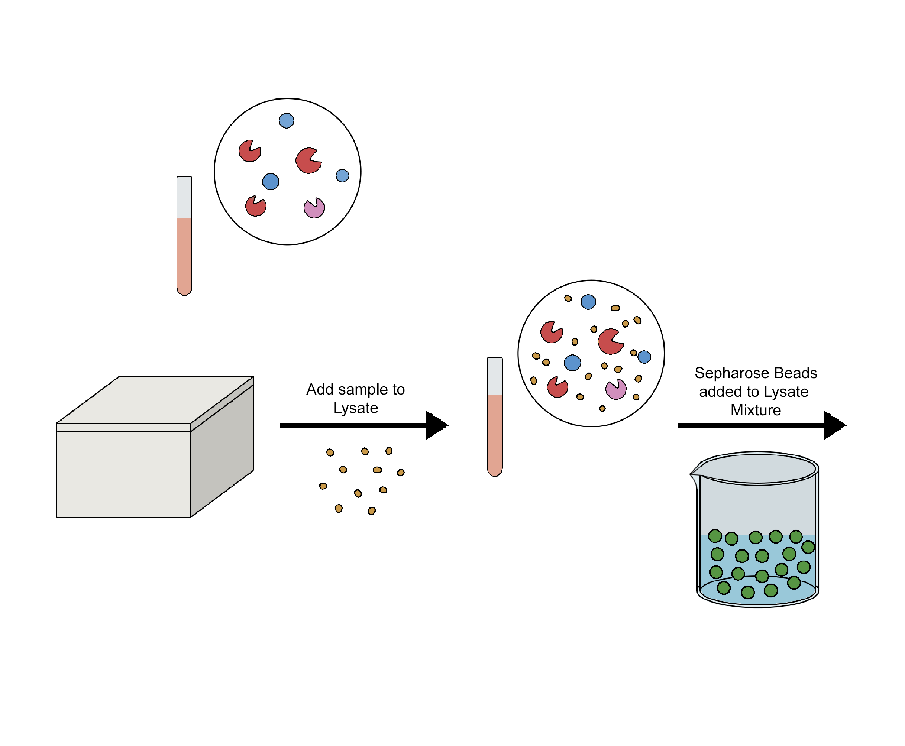

### Theory

Immunoprecipitation (IP) is a process that separates the target antigen from a mixture by using a specific antibody that binds to the target antigen, in this case, a protein. IP is based on the small-scale affinity purification of antigens by immobilising a specific antibody on a solid substrate, such as magnetic particles or agarose resin. Co-immunoprecipitation, chromatin immunoprecipitation, RNA immunoprecipitation, tandem immunoprecipitation, and individual nucleotide resolution crosslinking immunoprecipitation are some of the several types of immunoprecipitation, each of which is intended for a particular use. This technique uses the specificity of antigen-antibody interactions to investigate the roles, relationships, and alterations of proteins in biological materials. There are a variety of applications of immunoprecipitation, viz. protein-protein interactions, protein-DNA interactions, post-translational modifications, purification of proteins, detection of antigens in complex samples, etc. Affinity beads are crucial in immunoprecipitation because they attach to specific antibodies that bind to the target protein to create the antigen-antibody complex. The target protein's antigen may drag the entire target protein after an antigen-antibody combination has formed. After binding the antigen, antibody, and support, the beads are thoroughly cleaned. Using the proper elution buffer, the antigen is removed from the support, alternatively, antibodies and materials (such as cell lysate) can be incorporated after adding affinity beads to collect the antibody-antigen complex. The order of addition is one of several factors that should be considered when constructing the IP experiment depicted in the image below.

 

 

 

