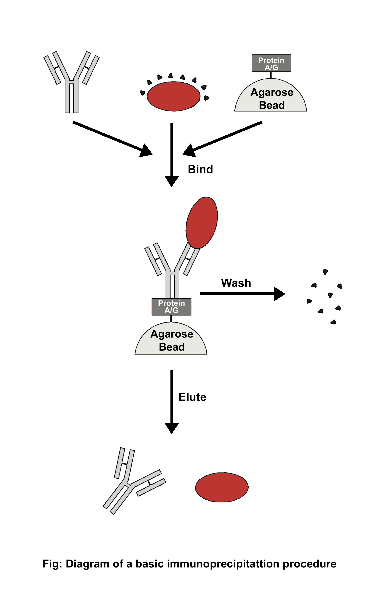
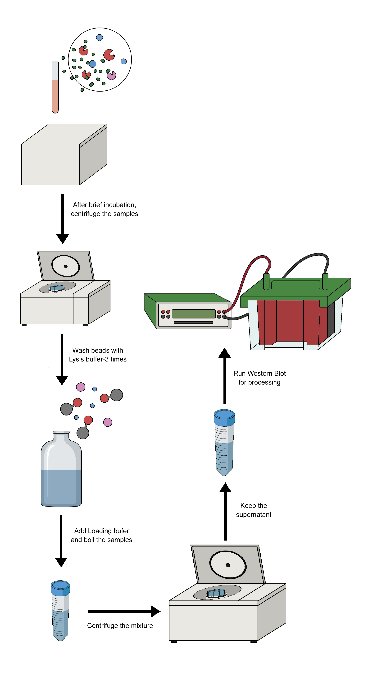
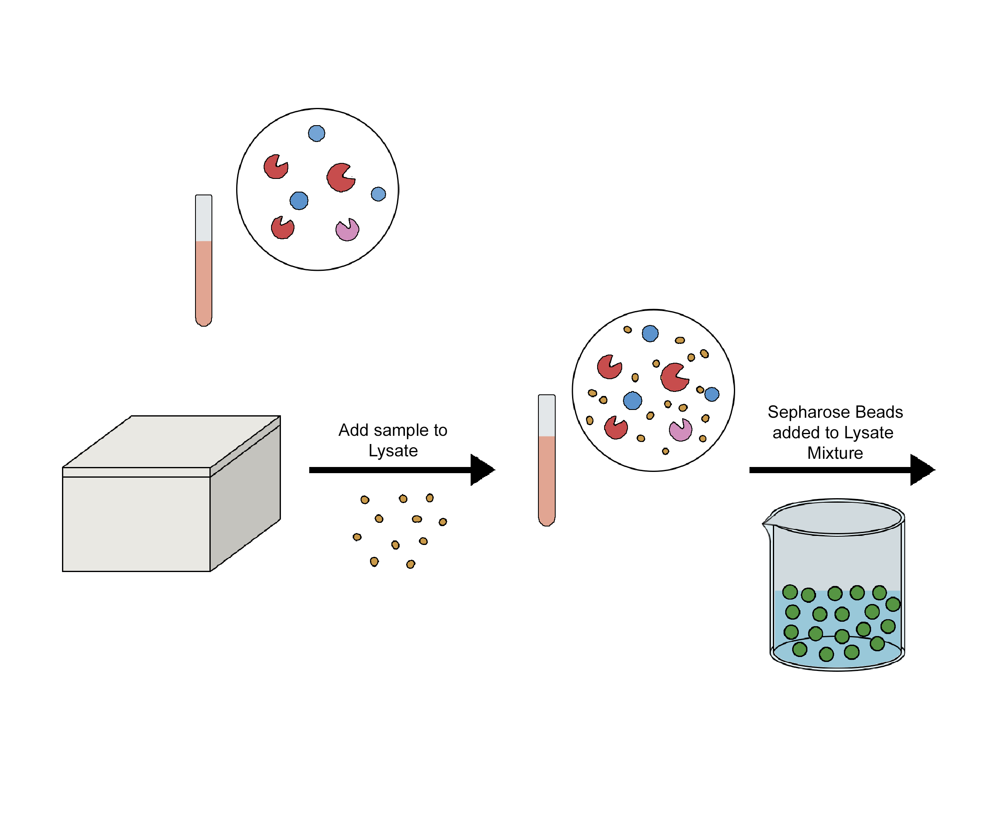

### Theory

Using a particular antibody that binds to the target antigen—in this case, a protein—a technique known as immunoprecipitation (IP) can separate the target antigen from a mixture. The base of IP is the small-scale affinity purification of antigens by immobilizing a particular antibody on a solid support, like agarose resin or magnetic particles. There are various forms of immunoprecipitation, each designed for a certain use: Co-immunoprecipitation, chromatin immunoprecipitation, RNA immunoprecipitation, tandem immunoprecipitation, and individual nucleotide resolution crosslinking immunoprecipitation. This technique uses the specificity of antigen-antibody interactions to investigate the roles, relationships, and alterations of proteins in biological materials. There are a variety of applications of immunoprecipitation, viz. protein-protein interactions, protein-DNA interactions, post-translational modifications, purification of proteins, detection of antigens in complex samples, etc. In immunoprecipitation, affinity beads are essential because they bind to particular antibodies that bind to the target protein to form the antigen-antibody complex. Following the formation of an antigen-antibody complex, the target protein's antigen can drag the entire target protein. The beads are adequately cleaned after binding the antigen, antibody, and support. The antigen is extracted from the support using an appropriate elution buffer. After adding affinity beads to capture the antibody-antigen complex, they alternately integrated antibodies and materials (such as cell lysate). When building the IP experiment shown in the image, a number of factors (including the sequence of addition) should be taken into account.

 

 

 

